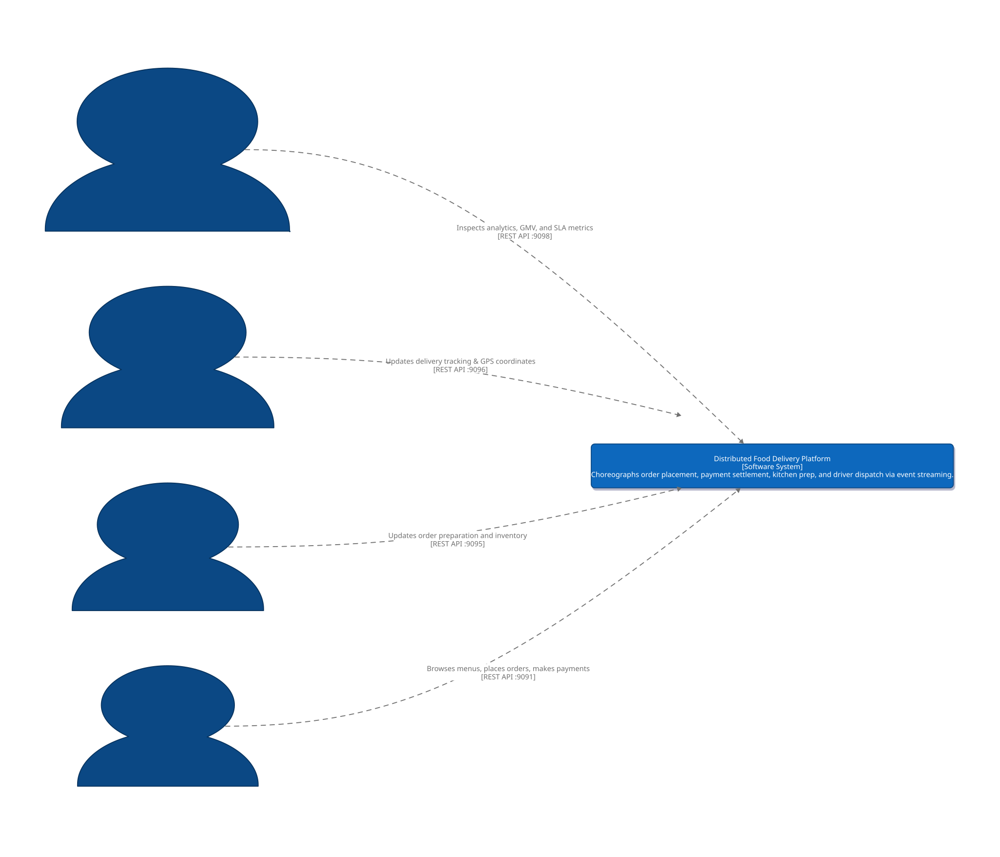
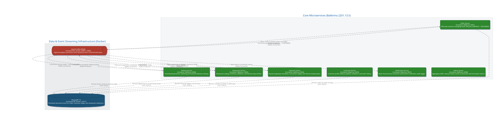
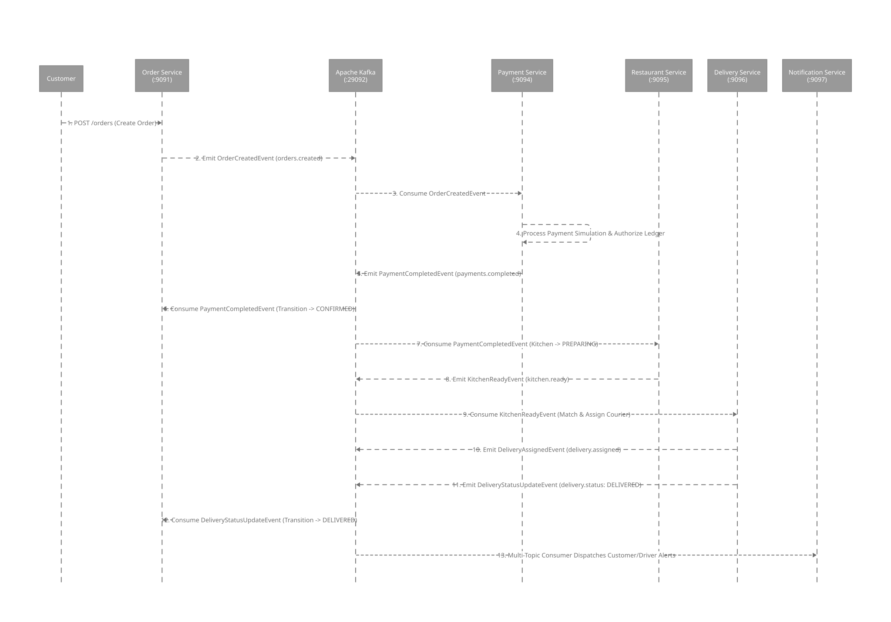

# Distributed Food Delivery Platform (Event-Driven Microservices)

[](https://github.com/CodeGrogu/DSA-Assignment-2/actions/workflows/ci.yml)
[](https://github.com/CodeGrogu/DSA-Assignment-2/actions/workflows/codeql.yml)
[](https://linear.app/peerpressure/project/distributed-food-delivery-platform-event-driven-microservices-83327d689776)
[](https://ballerina.io/)
[](https://kafka.apache.org/)
[](https://www.mongodb.com/)

An enterprise-grade, distributed, event-driven food delivery platform engineered with **Ballerina Swan Lake**, **Apache Kafka (KRaft mode)**, and **MongoDB**. Built by the **Peer Pressure** team for **DSA612S: Distributed Systems & Applications (Assignment 2)**.

---

## 1. System Architecture & C4 Diagrams

### 1.1 C4 Level 1: System Context Diagram

<p align="center">
  
</p>

<details>
<summary>📐 View D2 Source (docs/diagrams/system-context.d2)</summary>

```d2
direction: right

title: "System Context Diagram - Distributed Food Delivery Platform" {
  near: top-center
  shape: text
  style.font-size: 24
  style.bold: true
}

classes: {
  person: {
    shape: person
    style: {
      fill: "#0B4884"
      font-color: "#FFFFFF"
      stroke: "#07325D"
      stroke-width: 2
    }
  }
  system: {
    shape: rectangle
    style: {
      fill: "#1168BD"
      font-color: "#FFFFFF"
      stroke: "#0B4884"
      stroke-width: 2
      border-radius: 8
      shadow: true
    }
  }
}

customer: "Customer\n[Person]\nPlaces orders, tracks status, and receives notifications." {
  class: person
}

restaurant: "Restaurant Staff\n[Person]\nAccepts orders, updates prep stages, and manages menus." {
  class: person
}

driver: "Delivery Driver\n[Person]\nAccepts delivery assignments, updates status & GPS coordinates." {
  class: person
}

admin: "Platform Admin\n[Person]\nMonitors platform health, restaurant revenue, and driver SLA performance." {
  class: person
}

platform: "Distributed Food Delivery Platform\n[Software System]\nChoreographs order placement, payment settlement, kitchen prep, and driver dispatch via event streaming." {
  class: system
}

customer -> platform: "Browses menus, places orders, makes payments\n[REST API :9091]"
restaurant -> platform: "Updates order preparation and inventory\n[REST API :9095]"
driver -> platform: "Updates delivery tracking & GPS coordinates\n[REST API :9096]"
admin -> platform: "Inspects analytics, GMV, and SLA metrics\n[REST API :9098]"
```

</details>

### 1.2 C4 Level 2: Container Diagram & Event Choreography

<p align="center">
  
</p>

<details>
<summary>📐 View D2 Source (docs/diagrams/container-architecture.d2)</summary>

```d2
direction: down

title: "Container Architecture & Kafka Event Backbone" {
  near: top-center
  shape: text
  style.font-size: 24
  style.bold: true
}

classes: {
  service: {
    shape: rectangle
    style: {
      fill: "#2D882D"
      font-color: "#FFFFFF"
      stroke: "#1B5E20"
      stroke-width: 2
      border-radius: 6
      shadow: true
    }
  }
  datastore: {
    shape: cylinder
    style: {
      fill: "#1A5276"
      font-color: "#FFFFFF"
      stroke: "#114B5F"
      stroke-width: 2
      shadow: true
    }
  }
  broker: {
    shape: queue
    style: {
      fill: "#B03A2E"
      font-color: "#FFFFFF"
      stroke: "#78281F"
      stroke-width: 2
      shadow: true
    }
  }
}

services: "Core Microservices (Ballerina 2201.13.5)" {
  style: {
    fill: "#F4F6F7"
    stroke: "#BDC3C7"
    stroke-dash: 2
  }

  orderSvc: "Order Service\n[Container: Ballerina :9091]\nFSM state machine managing order lifecycles (CREATED -> DELIVERED)." {
    class: service
  }

  custSvc: "Customer Service\n[Container: Ballerina :9093]\nCustomer profile, delivery address validation, and order history." {
    class: service
  }

  restSvc: "Restaurant Service\n[Container: Ballerina :9095]\nRestaurant catalog, inventory validation, and kitchen prep emitter." {
    class: service
  }

  paySvc: "Payment Service\n[Container: Ballerina :9094]\nPayment gateway simulation, transaction ledger, and refund compensation." {
    class: service
  }

  delSvc: "Delivery Service\n[Container: Ballerina :9096]\nProximity-based driver matching and real-time delivery tracking." {
    class: service
  }

  notifSvc: "Notification Service\n[Container: Ballerina :9097]\nMulti-channel event consumer & persistent notification audit logger." {
    class: service
  }

  adminSvc: "Admin Service\n[Container: Ballerina :9098]\nAggregates GMV, revenue shares, driver turnaround, and SLA breach metrics." {
    class: service
  }
}

infrastructure: "Data & Event Streaming Infrastructure (Docker)" {
  style: {
    fill: "#EAECEE"
    stroke: "#BDC3C7"
    stroke-dash: 2
  }

  kafka: "Apache Kafka (KRaft)\n[ContainerDb: Docker :29092 / :9092]\nHigh-throughput, persistent event backbone with 10 partitioned topics." {
    class: broker
  }

  mongo: "MongoDB 7.0\n[ContainerDb: Docker :27017]\nPersistent document store for order, customer, ledger, and restaurant collections." {
    class: datastore
  }
}

# Event Interconnections
services.orderSvc -> infrastructure.kafka: "Emits orders.created, orders.cancelled\n[Kafka Producer]"
infrastructure.kafka -> services.paySvc: "Consumes orders.created\n[Kafka Consumer]"
services.paySvc -> infrastructure.kafka: "Emits payments.completed, payments.failed\n[Kafka Producer]"
infrastructure.kafka -> services.orderSvc: "Consumes payments.completed -> CONFIRMED\n[Kafka Consumer]"
infrastructure.kafka -> services.restSvc: "Consumes payments.completed -> PREPARING\n[Kafka Consumer]"
services.restSvc -> infrastructure.kafka: "Emits kitchen.ready\n[Kafka Producer]"
infrastructure.kafka -> services.delSvc: "Consumes kitchen.ready -> driver assigned\n[Kafka Consumer]"
services.delSvc -> infrastructure.kafka: "Emits delivery.assigned, delivery.status\n[Kafka Producer]"
infrastructure.kafka -> services.notifSvc: "Subscribes to all domain events\n[Kafka Consumer]"

# Database Interconnections
services.orderSvc -> infrastructure.mongo: "Persists orders & audit records\n[TCP :27017]"
services.custSvc -> infrastructure.mongo: "Persists customer profiles & addresses\n[TCP :27017]"
services.paySvc -> infrastructure.mongo: "Persists financial ledger transactions\n[TCP :27017]"
services.restSvc -> infrastructure.mongo: "Persists digital menus & operating hours\n[TCP :27017]"
services.delSvc -> infrastructure.mongo: "Persists driver routes & tracking state\n[TCP :27017]"
```

</details>

### 1.3 Event Choreography Flow

<p align="center">
  
</p>

<details>
<summary>📐 View D2 Source (docs/diagrams/event-choreography.d2)</summary>

```d2
shape: sequence_diagram

title: "Kafka Event Choreography & Order Lifecycle Sequence" {
  near: top-center
  shape: text
  style.font-size: 24
  style.bold: true
}

customer: Customer
orderSvc: "Order Service\n(:9091)"
kafka: "Apache Kafka\n(:29092)"
paySvc: "Payment Service\n(:9094)"
restSvc: "Restaurant Service\n(:9095)"
delSvc: "Delivery Service\n(:9096)"
notifSvc: "Notification Service\n(:9097)"

customer -> orderSvc: "1. POST /orders (Create Order)"
orderSvc -> kafka: "2. Emit OrderCreatedEvent (orders.created)"
kafka -> paySvc: "3. Consume OrderCreatedEvent" {
  style.stroke-dash: 3
}
paySvc -> paySvc: "4. Process Payment Simulation & Authorize Ledger"
paySvc -> kafka: "5. Emit PaymentCompletedEvent (payments.completed)"
kafka -> orderSvc: "6. Consume PaymentCompletedEvent (Transition -> CONFIRMED)" {
  style.stroke-dash: 3
}
kafka -> restSvc: "7. Consume PaymentCompletedEvent (Kitchen -> PREPARING)" {
  style.stroke-dash: 3
}
restSvc -> kafka: "8. Emit KitchenReadyEvent (kitchen.ready)"
kafka -> delSvc: "9. Consume KitchenReadyEvent (Match & Assign Courier)" {
  style.stroke-dash: 3
}
delSvc -> kafka: "10. Emit DeliveryAssignedEvent (delivery.assigned)"
delSvc -> kafka: "11. Emit DeliveryStatusUpdateEvent (delivery.status: DELIVERED)"
kafka -> orderSvc: "12. Consume DeliveryStatusUpdateEvent (Transition -> DELIVERED)" {
  style.stroke-dash: 3
}
kafka -> notifSvc: "13. Multi-Topic Consumer Dispatches Customer/Driver Alerts" {
  style.stroke-dash: 3
}
```

</details>

---

## 2. Zero-Collision Port Allocation Scheme

To prevent network port collisions between local host processes, Docker infrastructure, and microservices on developer workstations, all endpoints are mapped strictly according to the following registry:

| Component / Service | Internal Port | Host Port | Protocol | Purpose & Collision Safeguard |
| :--- | :---: | :---: | :---: | :--- |
| **Kafka Broker (Host Listener)** | `29092` | `29092` | PLAINTEXT_HOST | **Avoids collision with standard host Kafka port 9092** |
| **Kafka Broker (Internal)** | `9092` | `9092` | PLAINTEXT | High-speed inter-container communication on bridge network |
| **Kafka KRaft Controller** | `29093` | — | PLAINTEXT | Quorum consensus (ZooKeeper-free) |
| **Kafka UI Dashboard** | `8080` | `8085` | HTTP | Web management dashboard for topics and consumer groups |
| **MongoDB Primary** | `27017` | `27017` | TCP | Document storage for entity collections & ledgers |
| **Mongo Express UI** | `8081` | `8086` | HTTP | Interactive MongoDB web browser |
| **Order Service** | `9091` | `9091` | HTTP REST | Order intake, state machine, and customer query API |
| **Customer Service** | `9093` | `9093` | HTTP REST | Customer profile, addresses, and order history |
| **Payment Service** | `9094` | `9094` | HTTP REST | Payment simulation, transaction ledger, and refunds |
| **Restaurant Service** | `9095` | `9095` | HTTP REST | Menu catalog, operating hours, and stock management |
| **Delivery Service** | `9096` | `9096` | HTTP REST | Driver matching, dispatching, and tracking lifecycle |
| **Notification Service** | `9097` | `9097` | HTTP REST | Alert dispatching simulation and audit log API |
| **Admin Service** | `9098` | `9098` | HTTP REST | Executive analytics, GMV calculation, and SLA breach reports |

---

## 3. Kafka Topic Taxonomy & Schema Registry

All events are strongly typed via the shared contract library `codegrogu/events:0.1.0` in [`modules/events`](file:///modules/events):

| Topic Name | Partitions | Key Strategy | Emitted By | Primary Consumers | Event Record Type |
| :--- | :---: | :--- | :--- | :--- | :--- |
| `orders.created` | 3 | `customerId` | Order Service | Payment Service, Notification Service | `OrderCreatedEvent` |
| `orders.confirmed` | 3 | `orderId` | Order Service | Notification Service, Admin Service | `OrderConfirmedEvent` |
| `orders.cancelled` | 3 | `orderId` | Order Service | Payment Service (Refunds), Notification | `OrderCancelledEvent` |
| `payments.completed` | 3 | `orderId` | Payment Service | Order Service, Restaurant Service | `PaymentCompletedEvent` |
| `payments.failed` | 3 | `orderId` | Payment Service | Order Service (Abort FSM), Notification | `PaymentFailedEvent` |
| `orders.preparing` | 3 | `restaurantId`| Restaurant Service | Order Service, Notification Service | `KitchenPreparingEvent` |
| `orders.ready` | 3 | `restaurantId`| Restaurant Service | Delivery Service (Driver Dispatch) | `KitchenReadyEvent` |
| `delivery.assigned` | 3 | `driverId` | Delivery Service | Order Service, Notification Service | `DeliveryAssignedEvent` |
| `delivery.status` | 3 | `orderId` | Delivery Service | Order Service, Notification, Admin | `DeliveryStatusUpdateEvent` |
| `notifications.dispatched` | 3 | `recipientId` | Notification Service | Audit Logger, Admin Analytics | `NotificationEvent` |

---

## 4. Local Development Quickstart

### 4.1 Prerequisites
- [Ballerina Swan Lake](https://ballerina.io/downloads/) `2201.13.5`
- [Docker & Docker Compose](https://docs.docker.com/compose/)
- [Bun](https://bun.sh/) (strictly no npm)

### 4.2 Step 1: Clone and Configure Environment
```bash
git clone https://github.com/CodeGrogu/DSA-Assignment-2.git
cd DSA-Assignment-2

# Copy environment configuration
cp .env.example .env
```

### 4.3 Step 2: Bootstrap Local Infrastructure
Start Apache Kafka (KRaft mode) and MongoDB:
```bash
docker compose -f docker-compose.infra.yml up -d
```
Verify infrastructure health:
- **Kafka UI:** [http://localhost:8085](http://localhost:8085)
- **Mongo Express:** [http://localhost:8086](http://localhost:8086) (User: `root`, Password: `password`)

### 4.4 Step 3: Build & Install Shared Event Contracts
In the Ballerina monorepo, shared packages in `modules/` must be installed locally before microservices can compile:
```bash
cd modules/events
bal test
bal pack
bal push --repository local
cd ../..
```

### 4.5 Step 4: Build Microservices
Build all microservices:
```bash
# Example: Build Order Service
cd services/order_service
bal test
bal build
bal run
```

Test health check:
```bash
curl http://localhost:9091/health
# Response: {"status":"UP","service":"order_service","port":9091,"version":"0.1.0","contracts":"codegrogu/events:0.1.0"}
```

---

## 5. Team Attribution & Subsystem Ownership Matrix

Every team member has demonstrable code ownership across specific microservices, 5 parent issues, 10 subtasks, and 5 Pull Requests:

| Team Member | GitHub Handle | Service / Domain Ownership | Milestone | Parents | Subtasks | Pull Requests | Linear Keys |
| :--- | :--- | :--- | :---: | :---: | :---: | :---: | :---: |
| **Jaden Awaseb** | `@CodeGrogu` | **Order Service** & Monorepo Architecture | M1, M2, M4, M5 | #1 – #5 | #41 – #50 | #121 – #125 | `PEE-67`–`PEE-71` |
| **Henry Heita** | `@Henchoz` | **Kafka Infrastructure**, DLQ & Chaos | M1, M3, M4, M5 | #6 – #10 | #51 – #60 | #126 – #130 | `PEE-72`–`PEE-76` |
| **Florinda Funya** | `@Florriinnddaa` | **Customer Service** & MongoDB Persistence | M1, M2, M3, M5 | #11 – #15 | #61 – #70 | #131 – #135 | `PEE-77`–`PEE-81` |
| **Tapiwa Kelvin** | `@Jerganov` | **Restaurant Service** & Kitchen Processing | M1, M2, M3, M5 | #16 – #20 | #71 – #80 | #136 – #140 | `PEE-82`–`PEE-86` |
| **Kondwani Kunkwenzu** | `@Kondwani112206`| **Payment Service**, Ledger & Saga Refunds | M1, M2, M4, M5 | #21 – #25 | #81 – #90 | #141 – #145 | `PEE-87`–`PEE-91` |
| **Mayleenda** | `@itsyagirlmay` | **Delivery Service** & Driver Dispatch | M1, M3, M4, M5 | #26 – #30 | #91 – #100 | #146 – #150 | `PEE-92`–`PEE-96` |
| **Liina Massipa** | `@LiinaMassipa` | **Notification Service** & Admin Analytics | M1, M3, M4, M5 | #31 – #35 | #101 – #110 | #151 – #155 | `PEE-97`–`PEE-101` |
| **Nangu Tjizoo** | `@Nangukuii` | **E2E Testing**, Docker Compose & Defense | M1, M4, M5 | #36 – #40 | #111 – #120 | #156 – #160 | `PEE-102`–`PEE-106` |

---

## 6. Continuous Integration & Quality Gates

Every Pull Request and commit to `main` is validated by four automated quality gates:
1. **Ballerina Monorepo Quality Gate (`ballerina-ci`):** Topological build enforcing code formatting (`bal format`), automated unit test suites (`bal test`), package packing, local repository installation, and executable compilation (`bal build`).
2. **Docker Compose Validation (`docker-compose-validate`):** Verifies syntax, healthchecks, networks, and environment variables across `docker-compose.infra.yml` and `docker-compose.yml`.
3. **Postman Schema Linting (`postman-lint`):** Validates Postman collection JSON schemas using Bun.
4. **CodeQL Security Analysis (`codeql.yml`):** Analyzes workflow supply-chain security.
5. **PR Domain Scope Verification (`pr-scope-validate`):** Dynamically audits each Pull Request against designated domain boundaries and deliverables.

---

## 7. Submission & Defense Schedule

- **Hard Code Freeze:** **05 October 2026, 23:59 CAT**
- **Oral Defense Window:** **N/A**
- **Repository:** [https://github.com/CodeGrogu/DSA-Assignment-2](https://github.com/CodeGrogu/DSA-Assignment-2)
- **Linear Workspace:** [https://linear.app/peerpressure](https://linear.app/peerpressure)
