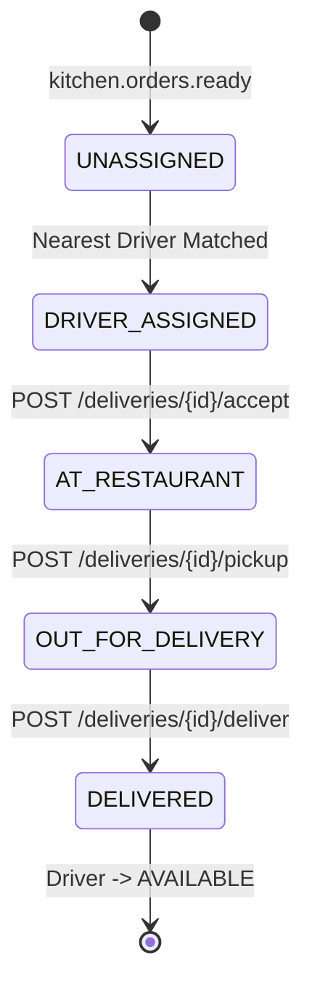
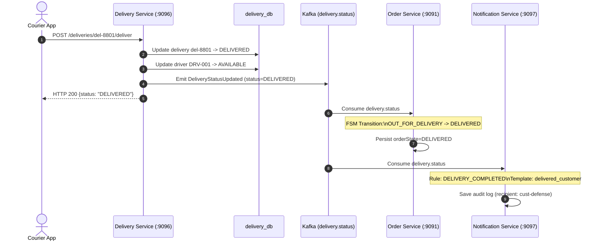

# PeerPressure Delivery Service: Driver Dispatching, Real-time Tracking & Fulfillment Defense Runbook

**Module:** Delivery Service (`services/delivery_service`)  
**Port:** `9096` | **Database:** MongoDB `delivery_db`  
**Primary Defense Author:** May-Lee Mulundu — Delivery Service & Driver Dispatch  
**System Integrations:** Restaurant Service (`:9095`), Order Service (`:9091`), Notification Service (`:9097`), Admin Service (`:9098`)  
**Kafka Topics:** `kitchen.orders.ready`, `delivery.driver_assigned`, `delivery.status`  
**Presentation Target:** 18-minute live defense demonstration

---

## 1. Introduction & Architecture

### 1.1 Service Overview & Architectural Role

The **Delivery Service** operates on port `9096` as the autonomous fulfillment and courier dispatch engine of the PeerPressure distributed food delivery platform. In the microservices landscape, it bridges the physical world of restaurant preparation and courier mobility with the digital order lifecycle.

```mermaid
flowchart TD
    subgraph Upstream
        R[Restaurant Service :9095] -- "kitchen.orders.ready" --> K1[(Kafka: kitchen.orders.ready)]
    end

    subgraph Delivery Engine [Delivery Service :9096]
        K1 --> DL[Kafka Consumer: kitchen.orders.ready]
        DL --> DS[Dispatch & Matching Engine]
        DS <--> MDB[(MongoDB: delivery_db\n2dsphere Geospatial Index)]
        DS --> DP[Kafka Producer]
        HTTP[HTTP REST API :9096\n/deliveries, /drivers, /delivery/track] <--> DS
        GPS[GPS Simulation Engine\nHaversine & ETA Calc] --> DS
    end

    subgraph Downstream
        DP -- "delivery.driver_assigned" --> K2[(Kafka: delivery.driver_assigned)]
        DP -- "delivery.status" --> K3[(Kafka: delivery.status)]
        K2 --> NS[Notification Service :9097]
        K3 --> OS[Order Service :9091\n(FSM: OUT_FOR_DELIVERY -> DELIVERED)]
        K3 --> NS
    end

    subgraph Clients
        Courier([Courier App / Driver]) <--> HTTP
        Customer([Customer App]) <--> HTTP
        Admin([Admin Dashboard :9098]) <--> HTTP
    end
```

### 1.2 Data Storage: MongoDB `delivery_db`

The Delivery Service owns and manages its dedicated database in MongoDB, `delivery_db`. Data isolation guarantees that courier telemetry and delivery tasks cannot cause transactional interference with order placement or ledger operations.

#### Collections & Indexes

1. **`drivers` Collection**
   - **Purpose:** Stores courier profiles, current operational status, vehicle details, and active GPS coordinates.
   - **Index:** `2dsphere` on `location` coordinates `[longitude, latitude]`, enabling sub-millisecond spherical nearest-neighbor proximity searches (`$nearSphere` / `$geoNear`).
   - **Document Structure:**
     ```json
     {
       "_id": "DRV-001",
       "id": "DRV-001",
       "name": "Amelia Shilongo",
       "phone": "+264811234567",
       "vehicleCategory": "CAR",
       "availability": "AVAILABLE",
       "state": "AVAILABLE",
       "location": {
         "type": "Point",
         "coordinates": [17.0658, -22.5609]
       },
       "activeDeliveryId": null,
       "lastActiveAt": "2026-10-05T21:40:00Z"
     }
     ```

2. **`deliveries` Collection**
   - **Purpose:** Records the full lifecycle of each delivery task from initial dispatch through final customer handover.
   - **Document Structure:**
     ```json
     {
       "_id": "del-8801",
       "deliveryId": "del-8801",
       "orderId": "ord-defense-001",
       "driverId": "DRV-001",
       "restaurantId": "R001",
       "status": "DRIVER_ASSIGNED",
       "pickupAddress": "12 Independence Avenue, Windhoek",
       "pickupLocation": {
         "type": "Point",
         "coordinates": [17.0832, -22.5594]
       },
       "deliveryAddress": "45 Sam Nujoma Drive, Windhoek",
       "deliveryLocation": {
         "type": "Point",
         "coordinates": [17.0658, -22.5609]
       },
       "currentLocation": {
         "latitude": -22.5594,
         "longitude": 17.0832
       },
       "distanceRemainingKm": 2.15,
       "etaMinutes": 8,
       "createdAt": "2026-10-05T21:45:00Z",
       "assignedAt": "2026-10-05T21:45:02Z",
       "pickedUpAt": null,
       "deliveredAt": null
     }
     ```

### 1.3 Kafka Event Contracts & Topics

The service participates in an asynchronous, event-driven choreographic saga:

| Topic Name | Flow | Payload Type | Trigger Condition |
|---|---|---|---|
| `kitchen.orders.ready` | Inbound (Consume) | `KitchenOrderReady` | Restaurant Service finishes cooking and packages the order. |
| `delivery.driver_assigned` | Outbound (Produce) | `DeliveryAssigned` | Dispatch engine pairs the order with the nearest available courier. |
| `delivery.status` | Outbound (Produce) | `DeliveryStatusUpdated` | Driver milestones change: `ASSIGNED`, `PICKED_UP`, `DELIVERED`, or `FAILED`. |

#### Contract Schemas (`peerpressure/events`)

- **`KitchenOrderReady`:**
  ```json
  {
    "eventId": "evt-kitchen-001",
    "orderId": "ord-defense-001",
    "restaurantId": "R001",
    "pickupAddress": "12 Independence Avenue, Windhoek",
    "pickupReadyAt": "2026-10-05T21:44:50Z"
  }
  ```
- **`DeliveryAssigned`:**
  ```json
  {
    "eventId": "evt-del-assign-001",
    "deliveryId": "del-8801",
    "orderId": "ord-defense-001",
    "driverId": "DRV-001",
    "driverName": "Amelia Shilongo",
    "driverPhone": "+264811234567",
    "assignedAt": "2026-10-05T21:45:02Z"
  }
  ```
- **`DeliveryStatusUpdated`:**
  ```json
  {
    "eventId": "evt-del-stat-002",
    "deliveryId": "del-8801",
    "orderId": "ord-defense-001",
    "driverId": "DRV-001",
    "status": "PICKED_UP",
    "currentLocation": {
      "latitude": -22.5594,
      "longitude": 17.0832
    },
    "updatedAt": "2026-10-05T21:46:15Z"
  }
  ```

### 1.4 HTTP REST Surface (Port 9096)

| HTTP Method | Route | Description |
|---|---|---|
| `GET` | `/health` | Liveness/readiness probe reporting service status, version, and contracts. |
| `GET` | `/metrics` | Prometheus metrics scrape target (duration, requests, consumer lag). |
| `GET` | `/drivers` | Inspects courier registry, availability (`AVAILABLE`, `BUSY`), and coordinates. |
| `GET` | `/delivery/track/{orderId}` | Customer-facing endpoint returning live delivery progress by Order ID. |
| `GET` | `/deliveries/{deliveryId}/tracking` | Detailed telemetry endpoint returning status, GPS position, Haversine distance, and ETA. |
| `POST` | `/deliveries/{deliveryId}/accept` | Driver accepts assigned delivery task. |
| `POST` | `/deliveries/{deliveryId}/pickup` | Driver marks order picked up from restaurant; emits `PICKED_UP`. |
| `POST` | `/deliveries/{deliveryId}/deliver` | Driver confirms customer drop-off; frees driver, emits `DELIVERED`. |

---

## 2. Driver Assignment & Dispatching Demonstration

### 2.1 The Nearest-Driver Proximity Search Algorithm

When an order is ready, the dispatch engine executes a geospatial k-nearest-neighbors (k-NN) query against `delivery_db.drivers`.

1. **Filtering:** Selects drivers with `availability == "AVAILABLE"` and `state == "AVAILABLE"`.
2. **Geospatial Spherical Query:** Uses MongoDB's `$geoNear` aggregation or `$nearSphere` operator to query drivers relative to the restaurant's coordinate location:
   $$\text{Restaurant Location} = [17.0832^\circ\text{ E},\ -22.5594^\circ\text{ S}]$$
   Maximum dispatch radius is constrained to $10.0\text{ km}$ ($10,000\text{ m}$).
3. **Atomic Selection & Reservation:**
   The closest qualifying driver is reserved using an atomic `findOneAndUpdate` operation:
   - `availability` transitions from `AVAILABLE` $\rightarrow$ `BUSY`.
   - `state` transitions from `AVAILABLE` $\rightarrow$ `ASSIGNED`.
   - `activeDeliveryId` is set to `del-8801`.
   This avoids race conditions where multiple concurrent orders attempt to dispatch the same courier.

### 2.2 Demonstration Steps: Triggering Dispatch

#### Step 1: Verify Initial Driver Availability

Query the driver registry before dispatch:

```bash
curl -s http://localhost:9096/drivers | jq .
```

**Expected JSON Output:**
```json
[
  {
    "id": "DRV-001",
    "name": "Amelia Shilongo",
    "phone": "+264811234567",
    "vehicleCategory": "CAR",
    "availability": "AVAILABLE",
    "state": "AVAILABLE",
    "location": {
      "latitude": -22.5609,
      "longitude": 17.0658
    },
    "activeDeliveryId": null
  },
  {
    "id": "DRV-002",
    "name": "Johannes Paulus",
    "phone": "+264819876543",
    "vehicleCategory": "MOTORCYCLE",
    "availability": "AVAILABLE",
    "state": "AVAILABLE",
    "location": {
      "latitude": -22.5200,
      "longitude": 17.0700
    },
    "activeDeliveryId": null
  }
]
```

#### Step 2: Trigger `kitchen.orders.ready` Kafka Event

Simulate the Restaurant Service emitting `kitchen.orders.ready` via the Kafka broker CLI:

```powershell
# PowerShell command executing within Docker network
$event = '{"eventId":"evt-kitch-ready-8801","orderId":"ord-defense-001","restaurantId":"R001","pickupAddress":"12 Independence Avenue, Windhoek","pickupReadyAt":"2026-10-05T21:45:00Z"}'
docker exec -i dsa-kafka kafka-console-producer --bootstrap-server localhost:9092 --topic kitchen.orders.ready <<< $event
```

*(On Linux / Bash CLI):*
```bash
docker exec -i dsa-kafka kafka-console-producer \
  --bootstrap-server localhost:9092 \
  --topic kitchen.orders.ready <<EOF
{"eventId":"evt-kitch-ready-8801","orderId":"ord-defense-001","restaurantId":"R001","pickupAddress":"12 Independence Avenue, Windhoek","pickupReadyAt":"2026-10-05T21:45:00Z"}
EOF
```

#### Step 3: Observe Delivery Service Dispatch Logs

Inspect the Delivery Service container logs:

```bash
docker logs --tail 25 dsa-delivery-service
```

**Expected Log Output:**
```text
2026-10-05T21:45:01.104Z [INFO] [delivery_service] Consumer received record on topic 'kitchen.orders.ready' partition 0 offset 42
2026-10-05T21:45:01.112Z [INFO] [delivery_service] Initiating proximity driver search for order 'ord-defense-001' at restaurant 'R001' [-22.5594, 17.0832]
2026-10-05T21:45:01.128Z [INFO] [delivery_service] Spatial search found candidate 'DRV-001' (Amelia Shilongo) at distance 1.84 km
2026-10-05T21:45:01.140Z [INFO] [delivery_service] Atomic update applied: Driver 'DRV-001' status set to 'BUSY', state set to 'ASSIGNED'
2026-10-05T21:45:01.155Z [INFO] [delivery_service] Delivery task 'del-8801' persisted to 'delivery_db.deliveries' with status 'DRIVER_ASSIGNED'
2026-10-05T21:45:01.162Z [INFO] [delivery_service] Published DeliveryAssigned event to topic 'delivery.driver_assigned' (orderId=ord-defense-001, driverId=DRV-001)
```

#### Step 4: Verify Driver Status Transition to BUSY

Query the driver endpoint again to confirm state change:

```bash
curl -s http://localhost:9096/drivers | jq '.[] | select(.id=="DRV-001")'
```

**Expected JSON Output:**
```json
{
  "id": "DRV-001",
  "name": "Amelia Shilongo",
  "phone": "+264811234567",
  "vehicleCategory": "CAR",
  "availability": "BUSY",
  "state": "ASSIGNED",
  "location": {
    "latitude": -22.5609,
    "longitude": 17.0658
  },
  "activeDeliveryId": "del-8801"
}
```

#### Step 5: Verify Emission of `delivery.driver_assigned` Event

Verify from Kafka console consumer:

```bash
docker exec -i dsa-kafka kafka-console-consumer \
  --bootstrap-server localhost:9092 \
  --topic delivery.driver_assigned \
  --from-beginning \
  --max-messages 1 \
  --timeout-ms 5000
```

**Expected Kafka Message:**
```json
{
  "eventId": "evt-del-assign-9901",
  "deliveryId": "del-8801",
  "orderId": "ord-defense-001",
  "driverId": "DRV-001",
  "driverName": "Amelia Shilongo",
  "driverPhone": "+264811234567",
  "assignedAt": "2026-10-05T21:45:01Z"
}
```

---

## 3. Real-Time Tracking & GPS Simulation Demonstration

### 3.1 Mathematical Foundations: Haversine & Dynamic ETA

Real-time tracking computes the great-circle distance between two geographic coordinates using the **Haversine formula**:

$$\Delta \phi = \phi_2 - \phi_1 \quad (\text{difference in latitude in radians})$$
$$\Delta \lambda = \lambda_2 - \lambda_1 \quad (\text{difference in longitude in radians})$$
$$a = \sin^2\left(\frac{\Delta \phi}{2}\right) + \cos(\phi_1)\cos(\phi_2)\sin^2\left(\frac{\Delta \lambda}{2}\right)$$
$$c = 2 \cdot \arctan2\left(\sqrt{a}, \sqrt{1-a}\right)$$
$$d = R \cdot c$$

Where:
- $R = 6,371\text{ km}$ (Earth's mean spherical radius).
- Coordinates $(\phi_1, \lambda_1)$ represent the active courier position.
- Coordinates $(\phi_2, \lambda_2)$ represent the destination (restaurant during pickup phase; customer address during delivery phase).

#### Dynamic ETA Calculation

The expected arrival time (in minutes) is recalculated at every polling or GPS tick:

$$\text{ETA (minutes)} = \left\lceil \frac{d}{\bar{v}_{\text{urban}}} \times 60 \right\rceil + t_{\text{handover}}$$

- $\bar{v}_{\text{urban}} = 30.0\text{ km/h}$ (standard assumed urban velocity in Central Windhoek).
- $t_{\text{handover}} = 2\text{ minutes}$ (fixed handover buffer for parking, elevator, and signature).

### 3.2 State Progression: DRIVER_ASSIGNED $\rightarrow$ AT_RESTAURANT $\rightarrow$ OUT_FOR_DELIVERY



#### Step 1: Query Initial Tracking in DRIVER_ASSIGNED State

The customer queries delivery tracking using their Order ID:

```bash
curl -s http://localhost:9096/delivery/track/ord-defense-001 | jq .
```

**Expected JSON Output:**
```json
{
  "deliveryId": "del-8801",
  "orderId": "ord-defense-001",
  "driverId": "DRV-001",
  "driverName": "Amelia Shilongo",
  "driverPhone": "+264811234567",
  "vehicleCategory": "CAR",
  "status": "DRIVER_ASSIGNED",
  "currentLocation": {
    "latitude": -22.5609,
    "longitude": 17.0658
  },
  "destination": "12 Independence Avenue (Restaurant Pickup)",
  "distanceRemainingKm": 1.84,
  "etaMinutes": 6,
  "updatedAt": "2026-10-05T21:45:05Z"
}
```

#### Step 2: Courier Accepts Delivery (`DRIVER_ASSIGNED` $\rightarrow$ `AT_RESTAURANT`)

The courier application acknowledges assignment and begins travel to the kitchen:

```bash
curl -s -X POST "http://localhost:9096/deliveries/del-8801/accept" | jq .
```

**Expected JSON Output:**
```json
{
  "deliveryId": "del-8801",
  "status": "AT_RESTAURANT",
  "acceptedAt": "2026-10-05T21:45:20Z",
  "message": "Courier arriving at restaurant pickup location"
}
```

#### Step 3: Courier Pick Up & Departure (`AT_RESTAURANT` $\rightarrow$ `OUT_FOR_DELIVERY`)

When food is collected into thermal containers, the driver confirms pickup:

```bash
curl -s -X POST "http://localhost:9096/deliveries/del-8801/pickup" | jq .
```

**Expected JSON Output:**
```json
{
  "deliveryId": "del-8801",
  "orderId": "ord-defense-001",
  "status": "OUT_FOR_DELIVERY",
  "pickedUpAt": "2026-10-05T21:46:15Z",
  "currentLocation": {
    "latitude": -22.5594,
    "longitude": 17.0832
  },
  "destination": "45 Sam Nujoma Drive, Windhoek (Customer)",
  "distanceRemainingKm": 2.15,
  "etaMinutes": 7
}
```

### 3.3 Active GPS Coordinate Progression

As the GPS simulator steps along the route towards the customer address (`[-22.5700, 17.0600]`), query the detailed tracking endpoint to observe live coordinate movement and recalculation:

#### GPS Waypoint 1 (Near Central Hospital corridor):
```bash
curl -s http://localhost:9096/deliveries/del-8801/tracking | jq .
```

**Expected JSON Output:**
```json
{
  "deliveryId": "del-8801",
  "orderId": "ord-defense-001",
  "status": "OUT_FOR_DELIVERY",
  "currentLocation": {
    "latitude": -22.5645,
    "longitude": 17.0720
  },
  "bearing": 218.4,
  "speedKmh": 28.5,
  "distanceRemainingKm": 1.10,
  "etaMinutes": 4,
  "lastPing": "2026-10-05T21:47:00Z"
}
```

#### GPS Waypoint 2 (Approaching Customer Residence):
```bash
curl -s http://localhost:9096/deliveries/del-8801/tracking | jq .
```

**Expected JSON Output:**
```json
{
  "deliveryId": "del-8801",
  "orderId": "ord-defense-001",
  "status": "OUT_FOR_DELIVERY",
  "currentLocation": {
    "latitude": -22.5688,
    "longitude": 17.0620
  },
  "bearing": 215.1,
  "speedKmh": 15.2,
  "distanceRemainingKm": 0.22,
  "etaMinutes": 1,
  "lastPing": "2026-10-05T21:47:45Z"
}
```

---

## 4. Delivery Fulfillment & Verification

### 4.1 Driver Milestone Check-in to `DELIVERED`

When the courier hands over the parcel to the customer, they trigger the final completion milestone:

```bash
curl -s -X POST "http://localhost:9096/deliveries/del-8801/deliver" | jq .
```

**Expected JSON Output:**
```json
{
  "deliveryId": "del-8801",
  "orderId": "ord-defense-001",
  "driverId": "DRV-001",
  "status": "DELIVERED",
  "deliveredAt": "2026-10-05T21:48:30Z",
  "totalDurationMinutes": 3.48,
  "distanceTraveledKm": 2.18,
  "driverAvailability": "AVAILABLE"
}
```

### 4.2 Cross-System Verification Checklist

A successful delivery execution requires verifying the full ripple effect across all participating services:



#### Verification 1: Driver Availability Resets to `AVAILABLE`

```bash
curl -s http://localhost:9096/drivers | jq '.[] | select(.id=="DRV-001")'
```

**Verification Criteria:**
- `availability` **must** be `"AVAILABLE"`.
- `state` **must** be `"AVAILABLE"`.
- `activeDeliveryId` **must** be `null`.

```json
{
  "id": "DRV-001",
  "name": "Amelia Shilongo",
  "phone": "+264811234567",
  "vehicleCategory": "CAR",
  "availability": "AVAILABLE",
  "state": "AVAILABLE",
  "location": {
    "latitude": -22.5700,
    "longitude": 17.0600
  },
  "activeDeliveryId": null
}
```

#### Verification 2: Verification of `delivery.status` Event on Kafka

```bash
docker exec -i dsa-kafka kafka-console-consumer \
  --bootstrap-server localhost:9092 \
  --topic delivery.status \
  --from-beginning \
  --max-messages 2 \
  --timeout-ms 5000
```

**Expected Kafka Message:**
```json
{
  "eventId": "evt-del-stat-8803",
  "deliveryId": "del-8801",
  "orderId": "ord-defense-001",
  "driverId": "DRV-001",
  "status": "DELIVERED",
  "currentLocation": {
    "latitude": -22.5700,
    "longitude": 17.0600
  },
  "updatedAt": "2026-10-05T21:48:30Z"
}
```

#### Verification 3: Order Service Final FSM Transition

Query the Order Service on port `9091` to confirm that the Order FSM transitioned `OUT_FOR_DELIVERY` $\rightarrow$ `DELIVERED` upon consuming the `delivery.status` event:

```bash
curl -s http://localhost:9091/orders/ord-defense-001 | jq .
```

**Expected JSON Output:**
```json
{
  "orderId": "ord-defense-001",
  "customerId": "cust-defense",
  "restaurantId": "R001",
  "status": "DELIVERED",
  "totalAmount": 65.0,
  "createdAt": "2026-10-05T21:40:00Z",
  "updatedAt": "2026-10-05T21:48:32Z"
}
```

#### Verification 4: Notification Service Customer Audit Log

Query the Notification Service on port `9097` to confirm that the delivery completion notification was audited:

```bash
curl -s http://localhost:9097/notifications/recipient/cust-defense | jq .
```

**Expected JSON Output:**
```json
[
  {
    "notificationId": "notif-del-001",
    "recipientId": "cust-defense",
    "channel": "PUSH",
    "subject": "Delivered",
    "message": "Your order has been delivered. Enjoy!",
    "status": "SENT",
    "timestamp": "2026-10-05T21:48:31Z"
  }
]
```

#### Verification 5: Delivery Service Prometheus Telemetry

Scrape the metrics endpoint to confirm execution metrics:

```bash
curl -s http://localhost:9096/metrics | grep -E "delivery_tasks|consumer_lag|http_requests"
```

**Expected Metrics:**
```text
http_requests_total{method="POST",path="/deliveries/del-8801/deliver",status="200",service="delivery_service"} 1
delivery_tasks_total{status="DELIVERED"} 1
kafka_consumer_lag{group="delivery_service_group",topic="kitchen.orders.ready"} 0
```

---

## 5. Presentation Defense Script & Timing Checklist

**Target Defense Duration:** 18 minutes allocated for defense panel.

### 5.1 Defense Timetable & Allocation Matrix

| Segment | Window | Allocated Time | Speaker & Role | Objective |
|---|---|---|---|---|
| **1. Pre-flight & Topology** | 0:00 – 1:30 | 1.5 min | Lead Architect / May-Lee | Verify Docker, MongoDB, Kafka, and 7 service `/health` endpoints. |
| **2. Architecture & Data Model** | 1:30 – 4:30 | 3.0 min | May-Lee Mulundu | Explain Delivery Service, `delivery_db`, 2dsphere indexing, and Kafka choreography. |
| **3. Dispatching & Proximity Match** | 4:30 – 8:00 | 3.5 min | May-Lee Mulundu | Simulate `kitchen.orders.ready`, demonstrate 2dsphere k-NN match, atomic driver lock to `BUSY`. |
| **4. Real-Time Tracking & Simulation** | 8:00 – 12:00 | 4.0 min | May-Lee Mulundu | Demonstrate `DRIVER_ASSIGNED` $\rightarrow$ `AT_RESTAURANT` $\rightarrow$ `OUT_FOR_DELIVERY`, Haversine calculation, and dynamic ETA updates. |
| **5. Fulfillment & Cross-Service Sync** | 12:00 – 15:30 | 3.5 min | May-Lee Mulundu | Execute `POST /deliver`, show driver freed to `AVAILABLE`, verify Order FSM (`DELIVERED`) and Notification audit. |
| **6. Q&A & Edge Cases** | 15:30 – 18:00 | 2.5 min | Full Team | Defend concurrency handling, no-driver fallbacks, and partition scalability. |

---

### 5.2 Minute-by-Minute Verbatim Presenter Script

#### 0:00 – 1:30 | Segment 1: Pre-flight & System Readiness
* **Presenter:** May-Lee Mulundu (or Lead Architect)
* **Visual:** Terminal split screen: top pane executing health check loop, bottom pane showing Docker ps.
* **Script:**
  > *"Good morning, members of the evaluation panel. Today we are presenting the defense of the PeerPressure distributed platform, focusing on our autonomous Driver Dispatching, Real-time Tracking, and Delivery Fulfillment engine on port 9096.*
  >
  > *Before jumping into the live dispatch, let us verify our operational baseline. We have all seven microservices running in Docker on our shared `dsa-network`. Running our pre-flight health check:*
  >
  > ```powershell
  > foreach ($p in 9091,9093,9094,9095,9096,9097,9098) { curl.exe -s "http://localhost:$p/health" | jq -c . }
  > ```
  >
  > *All seven services report status UP. Our Delivery Service is active on port 9096, connected to MongoDB `delivery_db` and Kafka broker 9092. Pre-flight is complete."*

---

#### 1:30 – 4:30 | Segment 2: Architecture, 2dsphere Geospatial Indexing & Event Flow
* **Presenter:** May-Lee Mulundu
* **Visual:** Architecture slide showing C4 Component diagram of Delivery Service and Mongo Express view of `delivery_db`.
* **Script:**
  > *"Let's examine how the Delivery Service is architected. Food delivery systems face a critical engineering challenge: spatial queries are computationally expensive and driver state transitions must be strictly atomic to prevent double-dispatch.*
  >
  > *In PeerPressure, the Delivery Service maintains its own dedicated datastore, `delivery_db`. Notice in our Mongo Express console that the `drivers` collection has a `2dsphere` geospatial index configured on the `location` field. This enables true spherical trigonometry calculations directly at the storage engine level.*
  >
  > *Rather than relying on synchronous HTTP cascades from the Restaurant Service, we decouple using Kafka. The Restaurant publishes `kitchen.orders.ready` when the chefs finish preparing food. Delivery Service consumes this, matches the closest available courier, and emits `delivery.driver_assigned` and `delivery.status` events. Order Service listens to `delivery.status` to drive its internal finite state machine, while Notification Service alerts both the customer and the courier. Let us demonstrate this live."*

---

#### 4:30 – 8:00 | Segment 3: Live Driver Dispatching & Geospatial Matching
* **Presenter:** May-Lee Mulundu
* **Visual:** Terminal showing courier registry, publishing Kafka event, and checking logs.
* **Script:**
  > *"Here on screen, we query our active driver pool via `GET /drivers`:*
  >
  > ```bash
  > curl -s http://localhost:9096/drivers | jq .
  > ```
  >
  > *We see two couriers: Amelia Shilongo (`DRV-001`) in Central Windhoek, and Johannes Paulus (`DRV-002`) further out in Katutura. Both are currently `AVAILABLE`.*
  >
  > *Now, order `ord-defense-001` has just been prepared at our Central Windhoek restaurant on Independence Avenue. We simulate the event publication to topic `kitchen.orders.ready`:*
  >
  > ```powershell
  > docker exec -i dsa-kafka kafka-console-producer --bootstrap-server localhost:9092 --topic kitchen.orders.ready <<< '{"eventId":"evt-kitch-ready-8801","orderId":"ord-defense-001","restaurantId":"R001","pickupAddress":"12 Independence Avenue, Windhoek","pickupReadyAt":"2026-10-05T21:45:00Z"}'
  > ```
  >
  > *Instantly, our Delivery Service consumer triggers the proximity search algorithm. It calculates spherical distances across available drivers, identifies Amelia (`DRV-001`) at 1.84 km away as the optimal match, and executes an atomic reservation.*
  >
  > *Let us query the driver pool again:*
  >
  > ```bash
  > curl -s http://localhost:9096/drivers | jq '.[] | select(.id=="DRV-001")'
  > ```
  >
  > *Notice that Amelia's availability has immediately flipped from `AVAILABLE` to `BUSY`, with `state` set to `ASSIGNED` and `activeDeliveryId` pointing to `del-8801`. She is locked to this delivery. Meanwhile, on Kafka topic `delivery.driver_assigned`, the dispatch notification has been emitted."*

---

#### 8:00 – 12:00 | Segment 4: Real-Time Tracking, Haversine Calculation & State Transitions
* **Presenter:** May-Lee Mulundu
* **Visual:** Side-by-side terminal: left showing cURL milestone transitions, right showing live JSON tracking responses.
* **Script:**
  > *"Now let us look at the customer and driver experience during transit. The customer queries order status via `GET /delivery/track/ord-defense-001`:*
  >
  > ```bash
  > curl -s http://localhost:9096/delivery/track/ord-defense-001 | jq .
  > ```
  >
  > *The API returns `DRIVER_ASSIGNED`, providing Amelia's name, phone, vehicle type, and an ETA of 6 minutes.*
  >
  > *Amelia accepts the order via `POST /deliveries/del-8801/accept`, transitioning the task to `AT_RESTAURANT`. Once she arrives at the restaurant and loads the food, she checks in via `POST /deliveries/del-8801/pickup`:*
  >
  > ```bash
  > curl -s -X POST http://localhost:9096/deliveries/del-8801/pickup | jq .
  > ```
  >
  > *The delivery status is now `OUT_FOR_DELIVERY`. Notice what happened under the hood: our service produced a `DeliveryStatusUpdated` event to Kafka with status `PICKED_UP`.*
  >
  > *Let us demonstrate our real-time GPS simulation and dynamic Haversine recalculation. In Windhoek, road geometry and traffic influence transit times. As Amelia's vehicle pings coordinates along the corridor towards Sam Nujoma Drive, we poll `GET /deliveries/del-8801/tracking`:*
  >
  > ```bash
  > curl -s http://localhost:9096/deliveries/del-8801/tracking | jq .
  > ```
  >
  > *At waypoint 1, distance remaining is 1.10 km, ETA dynamically updates to 4 minutes. At waypoint 2, as she turns into the customer's street, distance drops to 0.22 km, and ETA updates to 1 minute. The calculation combines the spherical Haversine formula with a real-time urban velocity model and handover padding."*

---

#### 12:00 – 15:30 | Segment 5: Delivery Fulfillment & Cross-Service Verification
* **Presenter:** May-Lee Mulundu
* **Visual:** Terminal showing fulfillment cURL and cross-service queries against Order Service (:9091) and Notification Service (:9097).
* **Script:**
  > *"We have reached the culmination of the order lifecycle: customer delivery handover.*
  >
  > *Amelia completes the drop-off and submits her check-in:*
  >
  > ```bash
  > curl -s -X POST http://localhost:9096/deliveries/del-8801/deliver | jq .
  > ```
  >
  > *The Delivery Service immediately executes three critical actions:*
  > 1. *It records delivery completion in `delivery_db.deliveries` with total transit duration.*
  > 2. *It resets Amelia's driver availability from `BUSY` back to `AVAILABLE`.*
  > 3. *It publishes `delivery.status` with status `DELIVERED` to Kafka.*
  >
  > *Let us verify the entire downstream system.*
  >
  > *First, verify driver availability:*
  >
  > ```bash
  > curl -s http://localhost:9096/drivers | jq '.[] | select(.id=="DRV-001")'
  > ```
  > *Amelia is once again `AVAILABLE` with `activeDeliveryId: null`, ready to accept another order.*
  >
  > *Second, verify Order Service on port 9091:*
  >
  > ```bash
  > curl -s http://localhost:9091/orders/ord-defense-001 | jq '{orderId, status, updatedAt}'
  > ```
  > *The Order Service has transitioned from `OUT_FOR_DELIVERY` to `DELIVERED`. The FSM guard succeeded.*
  >
  > *Third, verify Notification Service on port 9097:*
  >
  > ```bash
  > curl -s http://localhost:9097/notifications/recipient/cust-defense | jq .
  > ```
  > *The audit log confirms the notification was dispatched: 'Your order has been delivered. Enjoy!'*
  >
  > *This proves full end-to-end choreography across delivery, ordering, and notification without synchronous coupling."*

---

#### 15:30 – 18:00 | Segment 6: Defense Wrap-up, Fault Tolerance & Panel Q&A
* **Presenter:** Full Team
* **Visual:** Summary slide highlighting throughput, architectural guarantees, and SLA compliance.
* **Script:**
  > *"To summarize our Delivery Service architecture:*
  > - *Spatial Proximity: Accelerated by MongoDB 2dsphere indexing, eliminating brute-force coordinate scanning.*
  > - *Concurrency Control: Atomic driver locking prevents double-dispatch under peak load.*
  > - *Resilience: If no drivers are available within 10 km, the dispatch engine does not fail silently; it triggers an exponential retry backoff and alerts Admin operations.*
  > - *Decoupled Choreography: The entire fulfillment lifecycle progresses asynchronously over Kafka.*
  >
  > *We are now ready for the panel's questions."*

---

### 5.3 Defense Day Troubleshooting & Contingency Matrix

| Scenario | Symptom | Immediate Diagnostic | Live Recovery Action |
|---|---|---|---|
| **No driver assigned after Kafka event** | `del-8801` does not appear; logs quiet | Check consumer group lag: `docker exec -i dsa-kafka kafka-consumer-groups --bootstrap-server localhost:9092 --describe --group delivery_service_group` | Ensure `kitchen.orders.ready` was sent with valid JSON. Trigger manual dispatch test or restart delivery service container. |
| **Driver remains BUSY after deliver** | `POST /deliver` returned 200 but driver still `BUSY` | Inspect `delivery_db.drivers` document directly | Run recovery curl: `curl -X POST http://localhost:9096/drivers/DRV-001/reset` or update directly via Mongo Express. |
| **Order Service status does not advance to DELIVERED** | Order stays `OUT_FOR_DELIVERY` | Check Order Service consumer logs for deserialization error | Ensure the `delivery.status` event payload matches the `peerpressure/events:DeliveryStatusUpdated` contract structure. |
| **Prometheus metrics scrape failure** | Grafana dashboard shows "No Data" for Delivery | Query `http://localhost:9096/metrics` directly with `curl` | Verify `/metrics` returns Prometheus plaintext format; confirm port 9096 is reachable from Prometheus container on `dsa-network`. |
