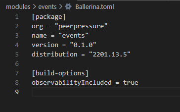
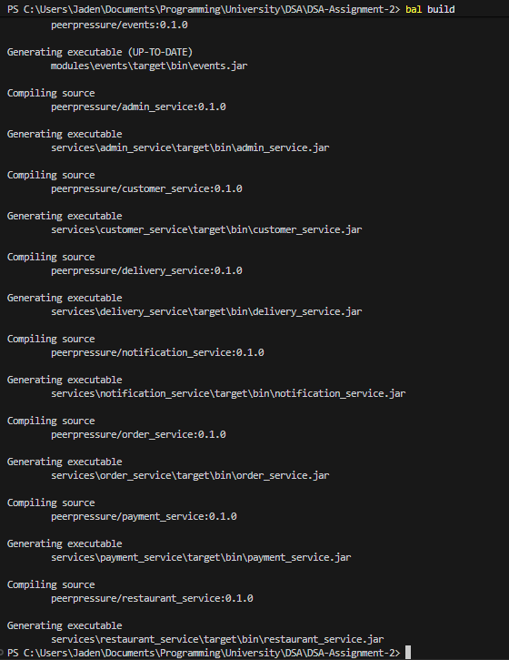
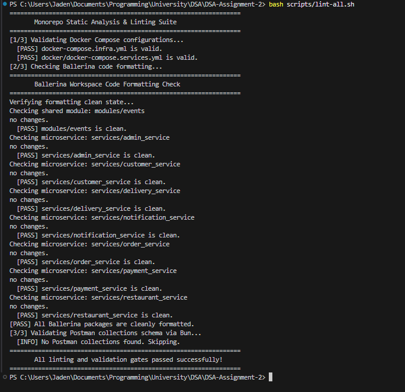
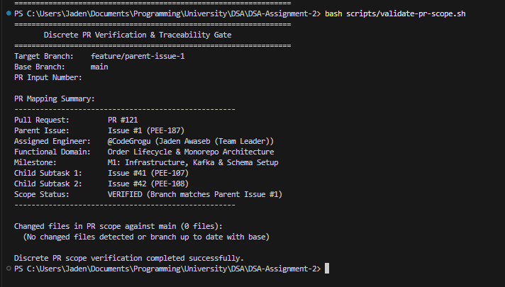
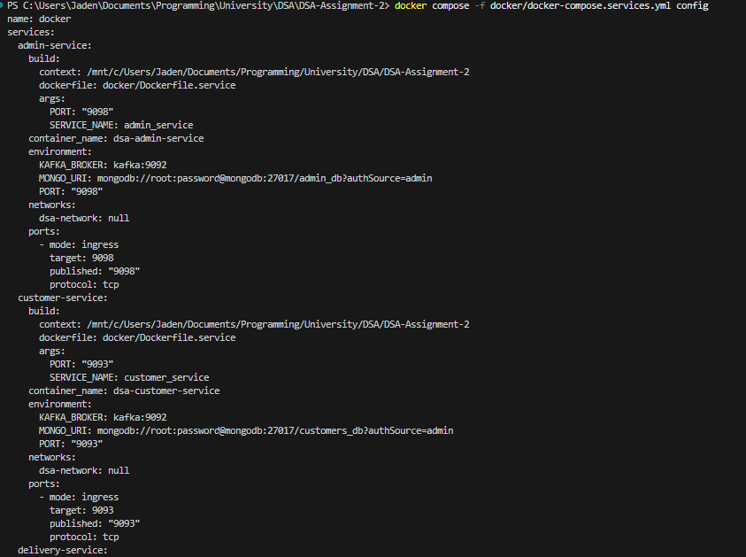
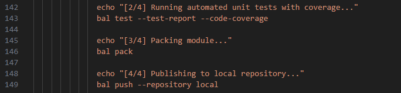
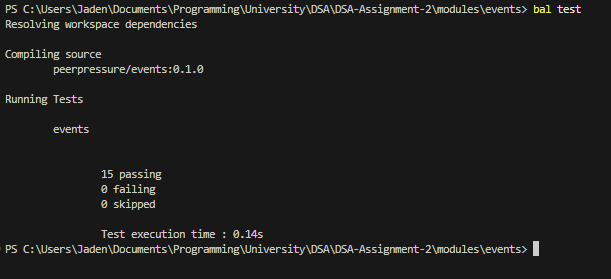

# PEE-187 Verification & Evidence
## Monorepo Architecture, Directory Scaffolding & Shared Event Schemas Library

| Metadata Field | Assigned Value / Traceability |
| :--- | :--- |
| **Engineer / Lead** | Jaden Awaseb (`@CodeGrogu` \| Student ID: `224055054`) - Team Leader |
| **Parent Issue** | [GitHub #1](https://github.com/CodeGrogu/DSA-Assignment-2/issues/1) / Linear [`PEE-187`](https://linear.app/peerpressure/issue/PEE-187/monorepo-architecture-directory-scaffolding-and-shared-event-schemas) *(formerly `PEE-67`)* |
| **Subtask 1 Closed** | [GitHub #41](https://github.com/CodeGrogu/DSA-Assignment-2/issues/41) / Linear [`PEE-107`](https://linear.app/peerpressure/issue/PEE-107/scaffold-ballerina-monorepo-directory-hierarchy-and-shared-build) *(Scaffold Monorepo Hierarchy & Build Tooling)* |
| **Subtask 2 Closed** | [GitHub #42](https://github.com/CodeGrogu/DSA-Assignment-2/issues/42) / Linear [`PEE-108`](https://linear.app/peerpressure/issue/PEE-108/define-and-validate-shared-ballerina-record-types-for-core-kafka) *(Define & Validate Shared Event Records)* |
| **Pull Request** | PR #121 (`feature/parent-issue-1` $\rightarrow$ `main`) |
| **Functional Domain** | Order Lifecycle & Monorepo Architecture |
| **Target Milestone** | **M1: Infrastructure, Kafka & Schema Setup** (Unlocked) |
| **Quality Gate Status** | **IN PROGRESS** (Verified Locally, Pending Final Review) |

---

### Acceptance Criteria Checklist

#### Subtask #41 (`PEE-107`) - Monorepo Hierarchy, Workspace & Build Tooling
- [x] **Directory Structure & Scaffolding:** Root directory structure established with all 7 microservices under `services/` (`order_service`, `customer_service`, `payment_service`, `restaurant_service`, `delivery_service`, `notification_service`, `admin_service`), each with an independent `Ballerina.toml`.
- [x] **Ballerina Workspace Configuration:** Root `Ballerina.toml` configured with `[workspace]` mapping all packages (`modules/events` and 7 microservices), enabling atomic multi-package compilation via `bal build`.
- [x] **Docker Infrastructure Configs:** Production containerfile `docker/Dockerfile.service`, cluster orchestration manifest `docker/docker-compose.services.yml` (zero port collisions on `dsa-network`), and `docker/README.md` operational.
- [x] **Build & Lint Tooling Suite:** Standardized automation scripts implemented in `scripts/`: `format-all.sh` (code style gate), `build-all.sh` (topological pipeline), and `lint-all.sh` (static analysis suite).

#### Subtask #42 (`PEE-108`) - Shared Contracts, Immutability & Schema Validation
- [x] **Immutable Event Schema Library:** `modules/events` exports deeply immutable (`readonly`) canonical records for `OrderCreated`, `PaymentCompleted`, `KitchenOrderReady`, and `DeliveryStatusUpdated`, along with backward-compatible aliases and immutable domain types (`Money`, `GeoCoordinate`, `Address`, `OrderItem`).
- [x] **JSON Serialization & Schema Validation:** Dedicated serialization functions and strict schema validators (`validateOrderCreated`, `validatePaymentCompleted`, `validateKitchenOrderReady`, `validateDeliveryStatusUpdated`) implemented in `modules/events/validation.bal`.
- [x] **Comprehensive Test Suite:** 15 automated unit tests in `modules/events/tests/events_test.bal` verifying serialization round-trip fidelity, runtime immutability assertions, and negative validation rules (missing fields, bad types, invalid enums, negative values, and out-of-bounds coordinates).
- [x] **Monorepo Decoupling:** Local dependency resolution via `bal pack` and `bal push --repository local` verified; all 7 microservices compile cleanly against the published module.

---

## Subtask #41 (`PEE-107`) Visual Evidence

### Exhibit A: Monorepo Decoupling via Local Package Repository & Workspace Config
In this project, `services/order_service` (and the other 6 microservices) are independent packages, each with their own `Ballerina.toml`. They do not use fragile relative file imports like `import ../../modules/events`.

Instead, they rely on Ballerina's local package repository and root workspace dependency resolution:

#### How It's Proven:
* When `modules/events` is packed and pushed (`bal push --repository local`), it publishes the compiled contract into the local package registry (`~/.ballerina/repositories/local`).
* When root `bal build` or `services/order_service` runs `bal build` and generates `order_service.jar`, it proves that the service successfully resolved, linked, and compiled against the new contract with zero type mismatches or missing symbol errors.

---

### Exhibit D: Root Monorepo Workspace Atomic Compilation
Running `bal build` from the workspace root validates that the entire monorepo builds together atomically. All inter-package dependencies resolve in topological order without publishing to external remotes:

#### How It's Proven:
* The Ballerina compiler detects `[workspace]` in root `Ballerina.toml`.
* `peerpressure/events:0.1.0` compiles first, producing `modules/events/target/bin/events.jar`.
* All 7 microservices (`admin_service`, `customer_service`, `delivery_service`, `notification_service`, `order_service`, `payment_service`, `restaurant_service`) compile cleanly into executable JARs with zero missing symbol errors.

---

### Exhibit E: Monorepo Formatting & Linting Quality Gates
All packages are continuously linted and verified via `bash scripts/lint-all.sh`, ensuring compliance before any code is committed:

#### How It's Proven:
* **Step 1:** Docker Compose configurations (`docker-compose.infra.yml` and `docker/docker-compose.services.yml`) validate without schema errors.
* **Step 2:** `bash scripts/format-all.sh --check` verifies that all 8 packages in `modules/` and `services/` conform strictly to Ballerina standard formatting.
* **Step 3:** Postman collection schemas are validated using `bun` (Directive 2 parity).

---

### Exhibit F: Discrete PR Verification & Traceability Gate
The scope boundary for Pull Request #121 is strictly enforced by `scripts/validate-pr-scope.sh`:

#### How It's Proven:
* The script confirms branch `feature/parent-issue-1` maps to **Parent Issue #1 (`PEE-187`)**.
* Explicitly verifies ownership by **@CodeGrogu (Jaden Awaseb)**.
* Validates child subtasks: **Issue #41 (`PEE-107`)** and **Issue #42 (`PEE-108`)**.

---

### Exhibit G: Microservices Docker Infrastructure & Port Allocation
The containerized runtime for the 7 microservices is configured under `docker/`:

#### How It's Proven:
* `docker/Dockerfile.service` defines a non-root (`ballerina` UID 10001) runtime image using `eclipse-temurin:17-jre-jammy`.
* `docker/docker-compose.services.yml` registers all 7 services onto the shared bridge network `dsa-network` with strictly non-overlapping host ports (`9091`, `9093`, `9094`, `9095`, `9096`, `9097`, `9098`).

---

### Exhibit C: GitHub Actions CI Quality Gate Parity
The CI Quality Gate mirrors the pipeline defined in `.github/workflows/ci.yml`:

#### How It's Proven:
* Local execution via `bash scripts/lint-all.sh` and `bash scripts/build-all.sh` mirrors the GitHub Actions pipeline step-for-step without failure, validating that the monorepo passes the `ballerina-ci` gate.

---

## Subtask #42 (`PEE-108`) Visual Evidence

### Exhibit B: Shared Event Schemas, Deep Immutability & Schema Validation
> **The Architecture Risk:** In an asynchronous event-driven system, message payloads exchanged across Kafka topics must be strictly immutable to guarantee thread safety and prevent unintended side effects across concurrent service threads. Furthermore, if Producer Service A serializes a payload differently from how Consumer Service B validates and deserializes it, the pipeline crashes at runtime with fatal deserialization errors.

**How it is proven:**
* **Deep Immutability (`readonly`):** Canonical event records (`OrderCreated`, `PaymentCompleted`, `KitchenOrderReady`, `DeliveryStatusUpdated`) and their nested composite types (`OrderItem`, `Address`, `GeoCoordinate`, `Money`) are defined as `readonly & record {| ... |}`. Ballerina guarantees deep immutability at both compile-time and runtime.
* **Backward-Compatible Type Aliases:** Legacy event aliases (`OrderCreatedEvent`, `PaymentCompletedEvent`, `KitchenReadyEvent`, `DeliveryStatusUpdateEvent`) are preserved as aliases to guarantee zero breaking changes for existing microservice consumers.
* **Strict Schema Validation & Serialization:** Dedicated functions in `modules/events/validation.bal` (`validateOrderCreated`, `validatePaymentCompleted`, `validateKitchenOrderReady`, `validateDeliveryStatusUpdated`, and serialization helpers) enforce closed-record constraints, type bounds, coordinate limits, and domain integrity rules.
* **15/15 Automated Unit Tests Passing:** Executed via `bal test` in `modules/events`:

**This proves that:**
* **Payload Immutability:** Runtime type assertions (`event is readonly`, `event.items is readonly`, `event.deliveryAddress is readonly`) pass for all event hierarchies.
* **Serialization Round-Trip Fidelity:** JSON serialization and deserialization preserve 100% precision for decimal amounts, ISO 8601 timestamps, nested coordinate objects, and default currencies (`NAD`).
* **Robust Negative Validation:** Corrupted payloads (missing required fields, negative order/payment amounts, empty item lists, invalid enum strings, and out-of-bounds GPS coordinates) are rejected with descriptive validation errors.

---

### Scope Traceability & Future Milestone Coverage

> [!NOTE]
> **Subtask & Milestone Alignment:**
> * **PEE-108 (Subtask #42):** Explicitly specifies unit tests validating the core event schemas: `OrderCreated`, `PaymentCompleted`, and `DeliveryStatusUpdated`. These represent the primary transaction backbone across Order, Payment, and Fulfillment domains.
> * **Downstream Service Logic (M2 - M4):** Individual microservice Kafka producers, event consumer loops, MongoDB collections, and domain handlers are assigned to their respective parent issues down the line:
>   * `PEE-188` (Parent #2 / Jaden): Order Service FSM & REST API
>   * `PEE-77` (Parent #11 / Florinda): Customer Service & Mongo Persistence
>   * `PEE-82` (Parent #16 / Tapiwa): Restaurant Service & Kitchen Processing
>   * `PEE-87` (Parent #21 / Kondwani): Payment Service & Ledger
>   * `PEE-92` (Parent #26 / May-Lee): Delivery Service & Driver Dispatch
>   * `PEE-97` (Parent #31 / Liina): Notification Service & Audit Log
>   * `PEE-102` (Parent #36 / Nangukuii): End-to-End Orchestration & Chaos Defense